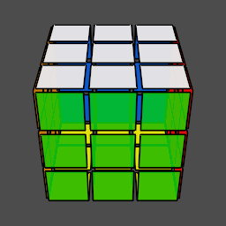

# Hyperspeedcube

Keyboard-controlled twisty puzzle simulator, with support for the following puzzles:

- 3x3x3 (standard Rubik's cube)
- 3x3x3x3 (4D "Rubik's hypercube")

## Screenshots

## Controls

The controls for the 3D Rubik's cube are mostly based on [Ryan Heise's speedcube simulator](https://www.ryanheise.com/cube/speed.html). Better documentation will be available soon.
